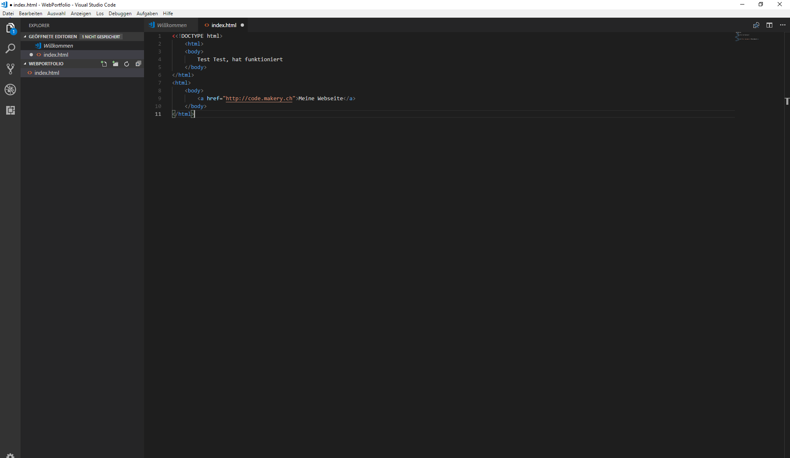
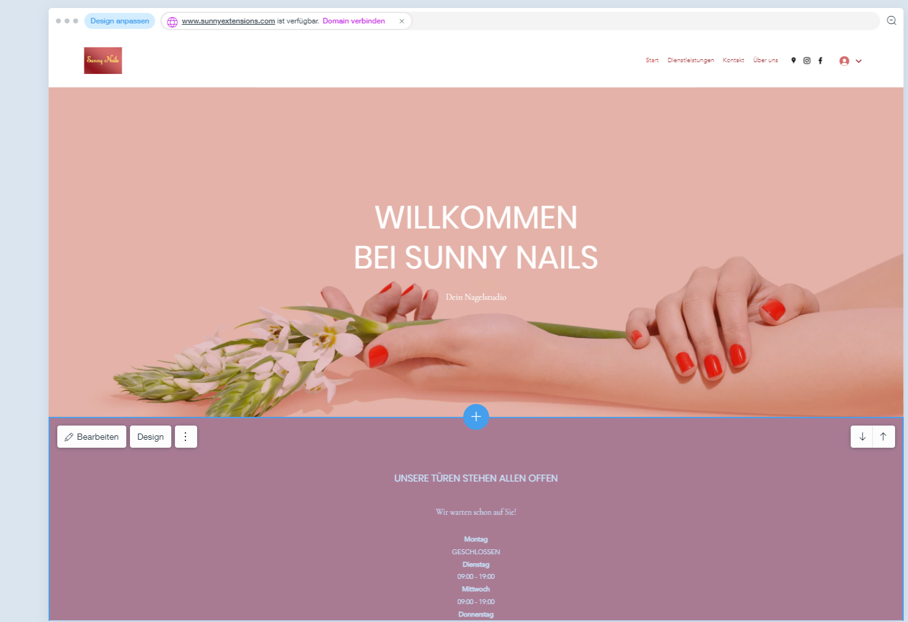

+++
title = "1. Lektion programmieren "
date = "2021-10-26"
draft = false
pinned = false
image = "sonnenaufgang.jpg"
description = "1. und 2. Lektion: Heute haben wir gelernt, wie man html Seiten programmiert. \n3. und 4. Lektion: Wir konnten an unserem Dienstleistungsprojekt weiter arbeiten. "
+++

