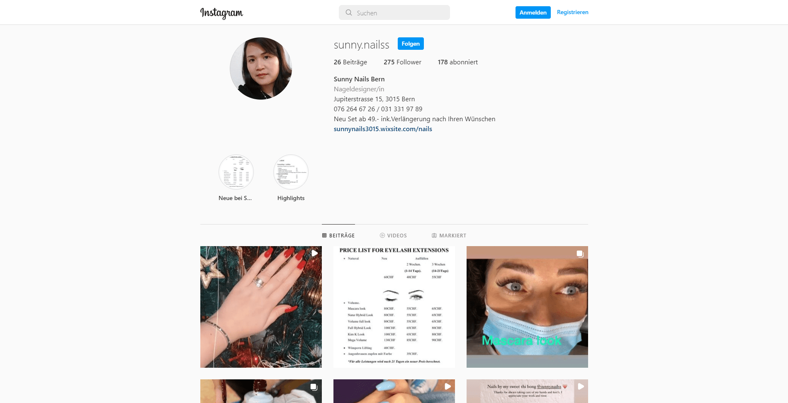
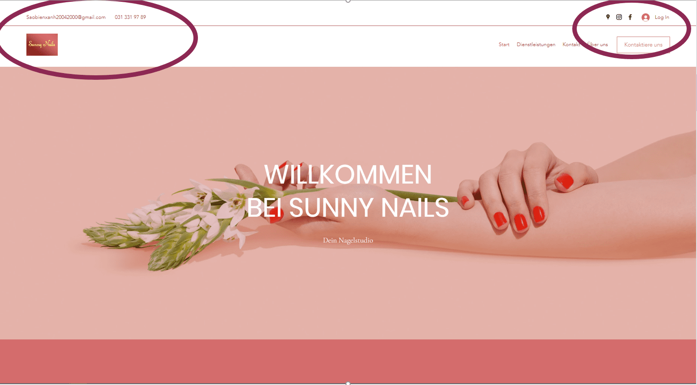
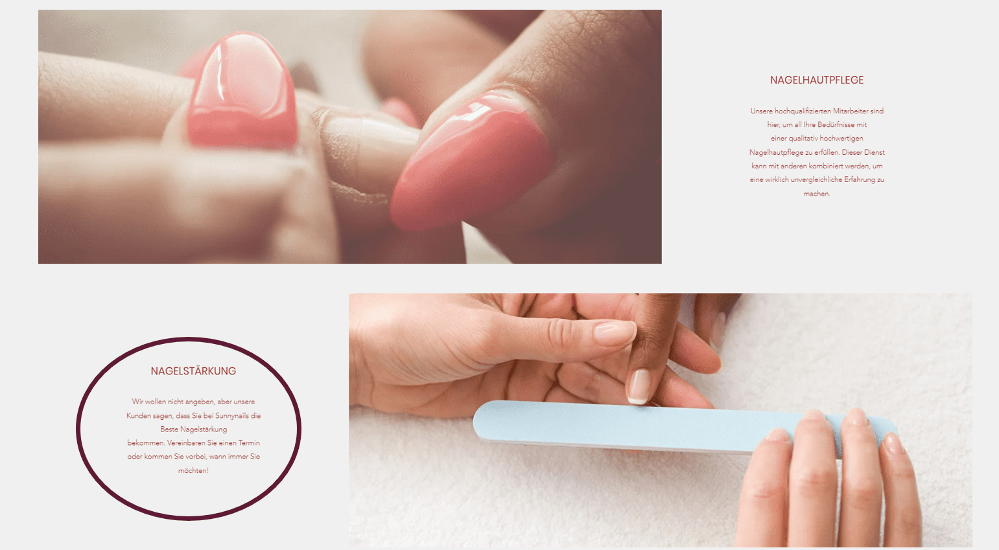

+++
title = "Abschlussbericht Web August bis Januar"
date = "2022-01-11"
draft = true
pinned = false
+++
Seit August 2021 habe ich das neue Pflichtwahlfach Web besucht. Ziemlich bald mussten wir uns dann mit einem eigenen Projekt befassen. Die Vorgabe war, unser Projekt soll eine Dienstleistung für eine Drittperson sein, im Bereich Website/Social Media. Das Projekt sollte in Zweierarbeit durchgeführt werden. Ich habe mich dann mit Milo zusammengetan und wir haben mit der Ideensuche begonnen. 

## Idee und Start ins Projekt

Wir haben in Form eines Mindmap alle unsere Ideen gesammelt und dann begonnen zu präzisieren. Ziemlich rasch haben wir uns dafür entschieden, eine Website für ein Beautyunternehmen zu gestalten. Viele in dieser Branche sind kleine Einzelunternehmen, die nicht viel Zeit und Möglichkeiten haben für Marketing oder Erneuerungen. Nach einem Nachmittag habe wir bereits verschieden Unternehmen, welche wir auf Google finden konnten, angerufen. 
Wir haben dann Thi Bong gefunden. Sie hat sich, trotz anfänglicher Skepsis, sehr über unsere Hilfe gefreut. Diese Skepsis ist für mich sehr verständlich, denn es ist nicht alltäglich, dass man am Telefon etwas gratis angeboten bekommt. Also mussten wir uns vorstellen und genau erklären warum wir unsere Arbeit gratis machen. Als sie dann verstanden hat, dass wir Schüler*innen sind uns sie unser Pilotprojekt wäre hat sie uns vertraut und eingeladen. Thi Bong ist Vietnamesin und hat ihr  Nagelstudio "Sunny Nails" hier in Bern. Sie würde gerne noch mehr Aufmerksamkeit gewinnen. Bereits am kommenden Montag habe ich mich bei ihr zu Hause getroffen. Wir haben alle Erwartungen, Möglichkeiten und Interessen ausgetauscht. In den Wochen darauf haben Milo und ich dann an der Website gearbeitet. Wir haben von ihr Bilder erhalten und uns regelmässig ausgetauscht, so konnte sie immer sagen was sie gerne anders hätte oder was ihr gefällt.

## Projekt

Wir haben eine Website auf Wix und eine Mailadresse erstellt. Thi Bong hatte bereits einen Google Eintrag, einen Instagram Account und einen Facebook Account. So konnten wir bereits Teile davon übernehmen. 
Ihr war es wichtig, dass die Website persönlich ist. Es sollte einen Text über sie geben, Bilder von ihren Arbeiten und ihren Angeboten. Die Website sollte individuell und werbend sein. Weiter haben wir noch ihre Social Media Accounts verknüpft. 
Wir haben alles Mögliche umgesetzt und so eingerichtet, dass wir schlussendlich die Website übergeben konnten. Denn nach diesem Projekt wollten wir die Website nicht mehr unterhalten. So haben wir bei der Übergabe noch einen Crashkurs gemacht. Erfreulicherweise habe ich nach einer Woche bereits erste Veränderungen von ihr gesehen. 

## Rückmeldung und Zufriedenheit

Thi Bong war mit unserer Arbeit sehr zufrieden. Sie hat sich über unser Engagement gefreut und führt ihre Website jetzt selbst. Sie hat sich bisher keine Website erstellt, weil sie das benötigte Know-how nicht hat. Zudem wäre ihr Deutsch wahrscheinlich nicht ausreichend um Fliesstexte zu verfassen. Deshalb konnten wir sie gut unterstützen und ihr weiterhelfen. Wir haben Thi Bong auch zu Hause mit ihrem eigenen Computer, Internet und der Mail Adresse weitergeholfen. Sie ist noch nicht so computeraffin und hat sich deshalb sehr über unsere Hilfe gefreut. Als «Bezahlung» haben wir einen riesigen Sack voller Schokolade und Riegel bekommen. 

## 
Persönliche Erfolge/Rückmeldung

Zusammengefasst hat mir die Arbeit gut gefallen und ich konnte viel lernen. Vor einem halben Jahr hätte ich nicht gedacht, dass ich selbst eine Website erstellen kann. Weiter habe ich auch gemerkt, wie einfach man eigentlich Kunden finden kann und eine kleine «Geschäftsidee» umsetzt. Ich habe für mich persönlich gelernt, dass man manchmal einfach loslegen kann und sich die Dinge schnell auch ergeben. Wenn ich Hilfe brauche, kann ich mich an die richtigen Personen wenden und Unterstützung holen. Weiter ist es sehr Sinnvoll in Teams zuarbeiten, denn so ist es möglich auf die individuellen Stärken einzugehen. Wenn man dann mal nicht zu zweit ist, muss man selber versuchen weiter zu kommen. Das ist in unserer Gruppe passiert, ca. in der Hälfte des Projekts ist Milo ausgestiegen. Dies sehe ich jedoch nicht nur negativ, denn so war ich gezwungen auch die Dinge zu machen, die ich noch nicht kannte oder die mir nicht so liegen. Teamarbeit hat viele Vorteile und ich habe ein weiteres Mal gesehen, dass zwei mehr erreichen als einer allein. Denn Milo ist sehr computeraffin und ich habe viele Ideen und ergreife gerne die Initiative. 

## Probleme/Schwierigkeiten

Die grösste Schwierigkeit war die Organisation im Team. Denn Milo hatte zu Beginn alle Unterlagen bei sich, als er dann einmal nicht im Unterricht war, hatte ich nichts dabei. Es ist also wichtig, dass man am Ende einer Arbeitsphase immer auf die nächste Lektion vorbereitet ist. Weiter habe ich zu beiden Treffen mit Thi Bong ohne Milo gehen müssen. Es war beide Male so, dass er am Tag des Treffens absagen musste. Ich konnte zum Glück schnell einen Ersatz organisieren. Das erste Mal kam Moritz und das zweite Mal Eric mit zu Thi Bong. Sie haben sich beide kurz mit dem Thema befasst und konnten mich so unterstützen. Zum Schluss musste Milo sich ganz aus dem Projekt zurückziehen und ich habe das Projekt alleine beenden müssen. Leider war ich wie bereits erwähnt nicht vertraut mit dem Websiteprogramm wie er und hatte zuerst Starschwierigkeiten. Zum Glück bekam ich dann Unterstützung von Marco und Mitschüler*innen. 

## 
Zukunft 

Im Neuen Semester werde ich ein neues Projekt mit Dominic beginnen. Zurzeit sind wir noch am Ideen sammeln und wissen noch nicht ganz wo es hingehen soll. Ich bin positiv eingestellt und bin davon überzeugt, dass ich von diesem Projekt viel für Weitere gelernt habe.