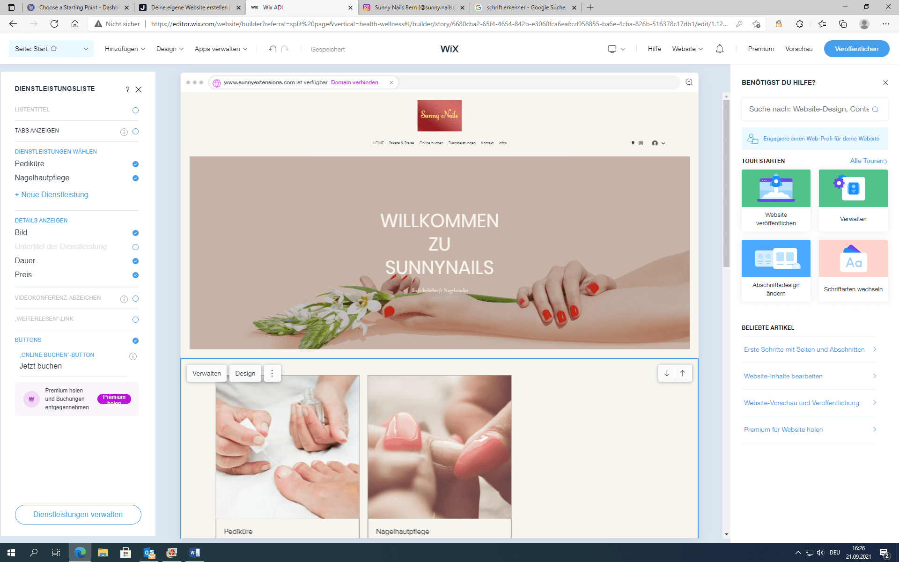
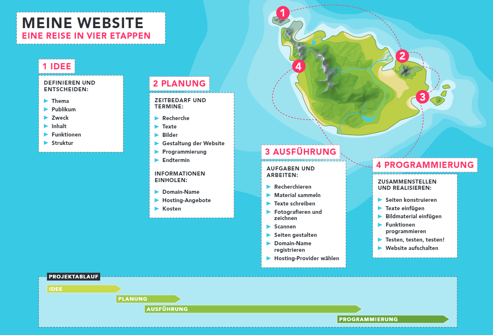

+++
title = "Beginn der Webseitengestaltung "
date = "2021-09-21"
draft = false
pinned = false
image = "pexels-bich-tran-636246-3-.jpg"
description = "Heute haben wir begonnen die Webseite zu gestallten.\nDer Projektablauf wurde soweit als möglich schriftlich festgehalten. \nIch habe noch einen Blogg nachgearbeitet und weitere kleine Arbeiten erledigt. "
+++
Hi,

