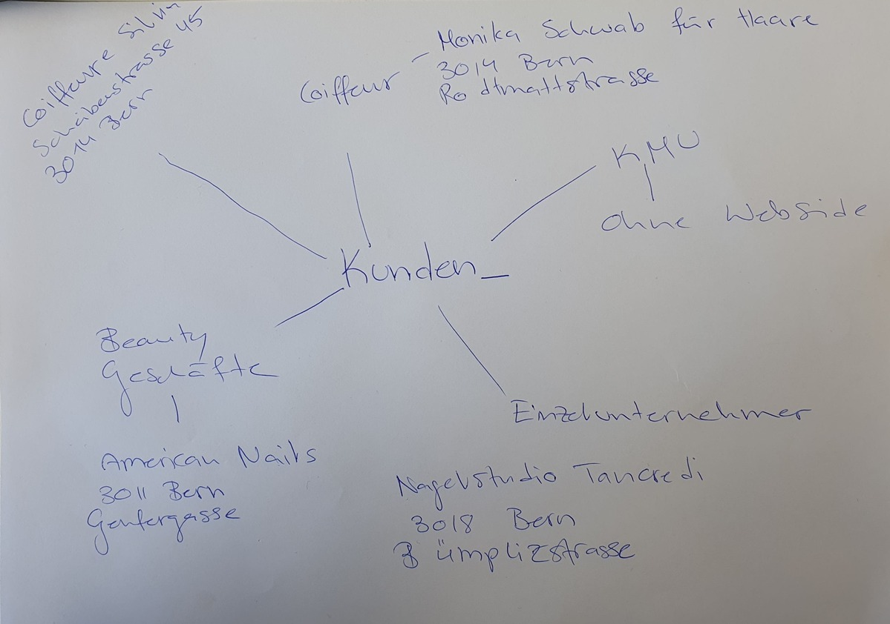

+++
title = "Gründung unseres Start-up"
date = "2021-08-31"
draft = false
pinned = false
description = "In einem Nachmittag eine Unternehmung gegründet. Idee gehabt und gleich umgesetzt, am Montag gehen wir zu unserem ersten Kunden. "
+++
Zu Beginn des Nachmittags hatten wir keinen Plan, welche Dienstleistung wir wem anbieten sollen. Bald haben wir herausgefunden, dass es in der Umgebung viele Coiffeur-, Kosmetik- und Nagelstudios gibt, die meisten haben jedoch noch keine eigene Website. Also wollen wir auf diese KMU's zugehen und Ihnen eine Website anbieten. Weiter würden wir für sie auch Werbung machen und ihnen  Schulungen anbieten, so dass sie die Website später selbst führen können. 

Schnell haben wir unsere Ideen in Taten umgesetzt und potenzielle Kunden angerufen. Und siehe da...;) der zweite Kunde hatte bereits Interessen an unserer Geschäftsidee und wir können ihn bereits nächsten Montag persönlich kennenlernen. 

Wir freuen uns auf unseren ersten Kontakt mit unseren Kunden. 

