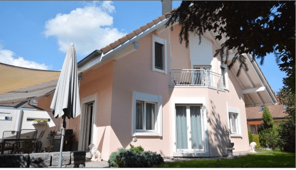

+++
title = "Neuer Auftrag "
date = "2022-03-29"
draft = false
pinned = false
image = "airbnb.png"
description = "Ich habe drei neue Aufgaben in angriff genommen :)\nIch betreue seit neuem ein Airbnb \nIch beaufsichtige Kinder\nIch helfe im Kosmetikvertrieb aus"
+++
Ich habe in den letzten Wochen ein neues Projekt gesucht. Durch den Zufall haben ich eine Frau kennengelernt, die jemanden braucht, der/die ihr hilft während den Ferien. So kam es dazu, dass ich ein Airbnb und ein Kosmetikvertrieb betreue. In den Frühlingsferien ist mein erster selbständiger Einsatz. 

Bis heute habe ich bereits die Aufgaben mit ihr zusammen gemacht um sie zu erlernen. Wenn sie selbst viel zutun hat helfe ich ihr auch neben den Ferien. 

Zusätzlich betreue ich bei Bedarf ihren 4 Jährigen Sohn. 

Ich freue mich sehr auf die neue Arbeit :)

