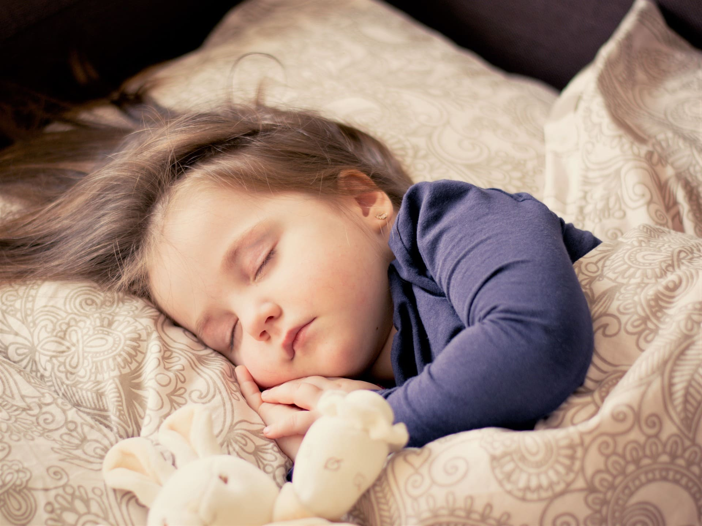

+++
title = "Neues Projekt, Babysitter gesucht oder willst du selbst ein Babysitter werden?"
date = "2022-02-22"
draft = false
pinned = false
image = "bed-g481a9f065_1920.jpg"
description = "Seit fünf Jahren beaufsichtige ich neben der Schule Kinder. Heute bin ich 20 Jahre alt und habe bereits viel Erfahrung mit verschiedenen Kinder gesammelt. Wenn du ein Babysitter brauchst oder mehr übers Babysitten erfahren möchtest, kannst du dich gerne bei mir Melden. "
+++
Ich  besuche in der Schule das Fach Web und soll dort ein Projekt verwirklichen oder ausbauen. Weil ich ein Herz für Kinder habe und beriets viel Erfahrung mit Kinder gesammelt habe, habe ich mich für ein Projekt mit Kinder entschieden. Ich liebe es mit Kindern zu arbeiten und übernehme gerne Verantwortung. Es macht mich glücklich fröhliche und zufriedene Kinder zusehen. Ich beaufsichtige Kinder, aller Altersgruppen, in diversen Familien. Gerne würde ich mein Job ausbauen, in dem ich neuen Babysittern helfe solche Verantwortungen zu übernehmen und zu meistern. Weiter würde ich  mich über eine neue Familie freuen, in der ich Babysitten kann. 

